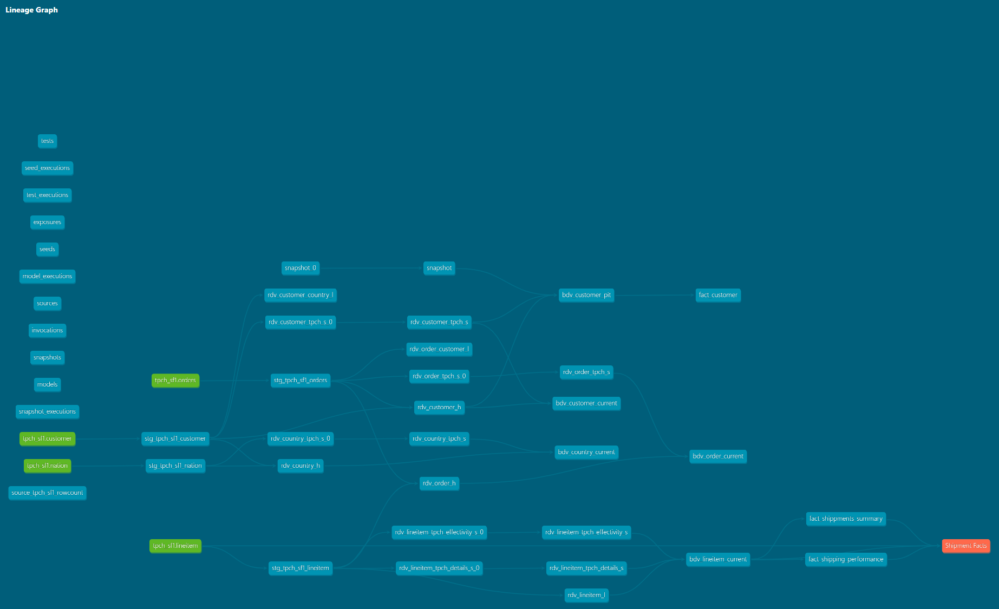

# DataUniversum dbt Project

## Table of Contents
- [Overview & Approach](#overview--approach)
- [Project Structure](#project-structure)
- [Data Model](#data-model)
- [Naming Conventions](#naming-conventions)
- [Connection Setup](#connection-setup)
- [Templates](#templates)
- [Dependencies](#dependencies)
- [Running the Models](#running-the-models)
- [Testing](#testing)
- [Documentation Approach](#documentation-approach)
- [Exposures](#exposures)
- [Resources](#resources)
- [Contact Information](#contact-information)

---

## Overview & Approach

This project implements a **Data Vault 2.0** architecture on **Snowflake** using **dbt**, demonstrating how raw transactional data can be transformed into governed, analytical data assets ready for consumption.

The source data is the **TPC-H SF1** benchmark dataset available natively in Snowflake Sample Data. It models a simplified order fulfilment domain covering customers, nations, orders, and line items.

### Why Data Vault 2.0?

Data Vault 2.0 was chosen because it provides:
- **Auditability** — every record carries load timestamp and record source, enabling full traceability
- **Resilience to change** — hub/link/satellite separation means new sources or attributes can be added without breaking existing models
- **Multi-temporal support** — separation of load time (`ldts`) and business timelines handles late-arriving and backdated data naturally
- **Scalability** — parallel loading patterns align well with Snowflake's architecture

### Why datavault4dbt?

The `datavault4dbt` package by Scalefree provides battle-tested, parameterised macros for all core DV2 objects (hubs, links, satellites, PITs, bridges):

- **Closer to DV2.0 specification** than alternatives like `automate_dv`
- **Greater customisability** — macros are configurable per object without forking the package
- **TurboVault integration** — enables metadata-driven model generation at scale
- **Premium Scalefree support** — a practical consideration for enterprise delivery where responsiveness matters

### Why Snowflake?

- **Familiarity & certification** — certified and hands-on experience across multiple enterprise implementations
- **Native TPC-H dataset** — available out of the box in `SNOWFLAKE_SAMPLE_DATA`, no data loading required
- **Performance** — micro-partition pruning benefits satellite queries significantly, especially on `ldts` range scans
- **Developer experience** — zero-copy cloning for dev/test environments, time travel for data recovery
- **Simplicity** — minimal infrastructure overhead, scales automatically, lets the focus stay on the data model

### Layer Architecture

```
SNOWFLAKE_SAMPLE_DATA (source)
        │
        ▼
      STG  — Staging: hash key generation, source aliasing, hashdiff computation
        │
        ▼
      RDV  — Raw Data Vault: Hubs, Links, Satellites (full history, immutable)
        │
        ▼
      BDV  — Business Data Vault: current state views joining hubs + sat v1
        │
        ▼
      CON  — Consumption: analytical aggregations ready for BI tools
```

---

## Project Structure

Our dbt project is organized as follows:

```
dbt_project/
├── models/
│   ├── Metadata/
│   └── DataVault/
│       ├── Stg/
│       │   └── tpch_sf1/
│       ├── Rdv/
│       ├── Bdv/
│       └── Con/
├── tests/
├── macros/
├── analysis/
├── seeds/
├── docs/
└── dbt_project.yml
```

- `models/`: Contains all dbt models
  - `Metadata/`: Models for metadata
  - `DataVault/`: Data Vault models
    - `Stg/`: Staging models — hash key generation via `datavault4dbt.stage()`
    - `Rdv/`: Raw Data Vault — Hubs, Links, Satellites (v0 incremental + v1 views)
    - `Bdv/`: Business Data Vault — current state views joining hub + sat v1
    - `Con/`: Consumption layer — analytical aggregations in `CON` schema
- `tests/`: Contains custom data tests
- `macros/`: Reusable SQL snippets and functions
- `analysis/`: Custom/ad-hoc queries for analysis needs
- `seeds/`: Static data files (CSVs) to be loaded into the data warehouse
- `docs/`: Contains custom model and test templates
- `dbt_project.yml`: Main configuration file for the dbt project

---

## Data Model

### Entities Covered

| Entity    | Hub              | Satellites                                              |
|-----------|------------------|---------------------------------------------------------|
| Customer  | `rdv_customer_h` | `rdv_customer_tpch_sf1_s`                               |
| Nation    | `rdv_country_h`  | `rdv_country_tpch_sf1_s`                                |
| Order     | `rdv_order_h`    | `rdv_order_tpch_sf1_s`                                  |
| Line Item | _(no hub)_       | `rdv_lineitem_effectivity_s`, `rdv_lineitem_details_s`  |

### Links

| Link                    | Connects                            |
|-------------------------|-------------------------------------|
| `rdv_customer_country_l`| Customer ↔ Nation                   |
| `rdv_order_customer_l`  | Order ↔ Customer                    |
| `rdv_lineitem_l`        | LineItem ↔ Order ↔ Part ↔ Supplier  |

### Key Design Decisions

- **LineItem has no Hub** — Line Item has no independent business existence. It only exists as the intersection of Order, Part, and Supplier, making it a pure Link entity in DV2 terms.
- **Degenerate Key** — `l_linenumber` has no hub of its own but is required in `hk_lineitem_l` to guarantee uniqueness within an order. This is a classic DV2 degenerate key pattern.
- **Two-Satellite split on LineItem** — effectivity satellite carries status flags and dates (bi-temporal candidates); details satellite carries financial measures and shipping descriptors plus raw business keys for Part and Supplier (hubs not yet implemented).
- **Bi-temporal design** — `l_shipdate` drives `effective_from` on the effectivity satellite, separating business time from load time. This correctly handles catchup loads and backdated postings.
- **Hub populated from multiple sources** — `rdv_order_h` and `rdv_customer_h` are fed from both their primary staging models and from `stg_tpch_sf1_lineitem` / `stg_tpch_sf1_orders` respectively, following DV2 multi-source hub loading.

### Lineage

### Lineage



---

## Naming Conventions

To maintain consistency across the project, we follow these naming conventions:

- Folder Names: Pascal Case
  - Example: `DataVault`, `Metadata`

- File Names: snake_case
  - Example: `dim_customer.sql`, `fact_orders.sql`

Please adhere to these conventions when creating new folders or files in the project.

### Data Vault Object Naming

All Data Vault objects use **singular** entity names (e.g. `customer`, not `customers`).

#### Prefixes

| Layer          | Prefix  | Example                        |
|----------------|---------|--------------------------------|
| Raw Data Vault | `rdv_`  | `rdv_customer_h`               |
| Business Vault | `bdv_`  | `bdv_customer_h`               |

#### Suffixes

| Object Type         | Suffix | Example                        |
|---------------------|--------|--------------------------------|
| Hub                 | `_h`   | `rdv_customer_h`               |
| Link                | `_l`   | `rdv_order_customer_l`         |
| Satellite           | `_s`   | `rdv_customer_tpch_sf1_s`      |
| Effectivity Sat     | `_s`   | `rdv_lineitem_effectivity_s`   |

#### Satellite Naming

Satellites include the **source system name** to reflect their origin, making multi-source scenarios explicit:

```
rdv_{entity}_{source_system}_s
```

Examples:
- `rdv_customer_tpch_sf1_s` — customer satellite from TPC-H SF1
- `rdv_order_tpch_sf1_s` — order satellite from TPC-H SF1
- `rdv_lineitem_effectivity_s` — effectivity satellite for line item (bi-temporal)
- `rdv_lineitem_details_s` — details satellite for line item

#### Full Examples

| Object                         | Name                              |
|--------------------------------|-----------------------------------|
| Customer Hub                   | `rdv_customer_h`                  |
| Order Hub                      | `rdv_order_h`                     |
| Order-Customer Link            | `rdv_order_customer_l`            |
| LineItem Link                  | `rdv_lineitem_l`                  |
| Customer Satellite             | `rdv_customer_tpch_sf1_s`         |
| Order Satellite                | `rdv_order_tpch_sf1_s`            |
| LineItem Effectivity Satellite | `rdv_lineitem_effectivity_s`      |
| LineItem Details Satellite     | `rdv_lineitem_details_s`          |

---

## Connection Setup

This project connects to Snowflake using **key-pair authentication**.

### Snowflake User Setup

This project uses a dedicated service account `DBT_DATAUNIVERSUM_SVC` with role `DBT_DATAUNIVERSUM_ROLE` and `COMPUTE_WH` warehouse. Authentication is via RSA key-pair — no password, no MFA interference.

Two environments are configured:
- **DEV** — database `DATAUNIVERSUM`
- **PROD** — database `DATAUNIVERSUM_PROD`

The RSA public key is registered against the service user in Snowflake. The private key is referenced locally via `private_key_path` in `profiles.yml` and stored securely outside the repository.


### profiles.yml

The `profiles.yml` is stored locally at `~/.dbt/profiles.yml` and is never committed to the repository.

```yaml
datauniversum:
  target: dev
  outputs:
    dev:
      type: snowflake
      account: <your_account_identifier>
      user: DBT_DATAUNIVERSUM_SVC
      private_key_path: ~/.ssh/rsa_key.pem
      private_key_passphrase: <passphrase_if_applicable>
      role: DBT_DATAUNIVERSUM_ROLE
      database: DATAUNIVERSUM
      warehouse: COMPUTE_WH
      schema: PUBLIC
      threads: 4
    prod:
      type: snowflake
      account: <your_account_identifier>
      user: DBT_DATAUNIVERSUM_SVC
      private_key_path: ~/.ssh/rsa_key.pem
      private_key_passphrase: <passphrase_if_applicable>
      role: DBT_DATAUNIVERSUM_ROLE
      database: DATAUNIVERSUM_PROD
      warehouse: COMPUTE_WH
      schema: PUBLIC
      threads: 4
```

---

## Templates

Templates provide reusable structures for common coding patterns.

Templates for both model and generic test yaml files can be accessed under the `docs/_templates/` folder and related `.md` file.

---

## Dependencies

This project uses the following dbt packages:

- `dbt_utils` — utility macros including `unique_combination_of_columns` test
- `datavault4dbt` — Data Vault 2.0 macro library by Scalefree
- `dbt_artifacts` — logging and monitoring of dbt run metadata, with a local override macro

Ensure these packages are listed in your `packages.yml` file and installed using `dbt deps`.

---

## Running the Models

To run the models in this project, follow these steps:

1. Ensure you have dbt installed and configured with your data warehouse.

2. Install project dependencies:

   ```bash
   dbt deps
   ```

3. Run all models:

   ```bash
   dbt run
   ```

   To run specific layers:

   ```bash
   dbt run --select tag:stg
   dbt run --select tag:rdv
   dbt run --select tag:bdv
   dbt run --select tag:con
   ```

4. Run all models and tests upstream of an exposure in one command:

   ```bash
   dbt build --select +exposure:shipment_facts
   ```

5. Run tests:

   ```bash
   dbt test
   ```

6. Generate and view documentation:

   ```bash
   dbt docs generate
   dbt docs serve
   ```

7. Run a macro:

   ```bash
   dbt run-operation macro_name --args '{arg1: value1, arg2: value2}'
   ```

---

## Testing

Data quality is enforced at every layer using dbt tests defined in the model yaml files.

Full details on the generic Data Vault test patterns applied in this project are documented in [`docs/_templates/tests/DataVault_generic.md`](docs/_templates/tests/DataVault_generic.md).

### Generic Tests Applied

Generic tests cover hub uniqueness, null checks on technical and business keys, referential integrity between satellites and hubs, and unique combination of columns on satellites and links. These are applied consistently across all RDV objects.

### Specific Tests

- **`c_name` not_null** on `rdv_customer_tpch_sf1_s` — ensures customer name is never null
- **`n_name` not_null** on `rdv_country_tpch_sf1_s` — ensures country name is never null

---

## Documentation Approach

All models are documented using dbt's `doc()` block pattern, keeping SQL models clean and descriptions maintainable separately.

### File Naming

yaml and md documentation files use a leading underscore for easier navigation and to group them at the top of the folder in most editors:

```
_tpch_sf1.yml        — staging model definitions
_tpch_sf1_docs.md    — staging doc blocks
_rdv_customer.yml    — RDV model definitions
_rdv_customer.md     — RDV doc blocks
```

> **Note on yaml file granularity:** Currently each layer has a single yaml file covering all models in that folder. As the project grows, it is recommended to split into one yaml per model (e.g. `_rdv_customer.yml`, `_rdv_order.yml`) for easier maintenance. Tools like [dbt-osmosis](https://github.com/z3z1ma/dbt-osmosis) or [dbt-codegen](https://github.com/dbt-labs/dbt-codegen) can assist with generating and managing per-model yaml files.

### Doc Block Structure

Documentation is split across dedicated `.md` files per layer:

| File                  | Covers                                      |
|-----------------------|---------------------------------------------|
| `tech_columns.md`     | Shared DV2 technical columns (ldts, rsrc, hashdiff, effective_from, etc.) |
| `tpch_sf1_docs.md`    | Source table and column descriptions        |
| `stg_tpch_sf1_docs.md`| Staging model and hash key descriptions     |
| `rdv_*_docs.md`       | RDV object descriptions per entity group    |

### Generating Docs

```bash
dbt docs generate
dbt docs serve
dbt docs generate --static
```

Static documentation is published and available at:

**[https://datauniversum.github.io/dbt_project/#!/overview](https://datauniversum.github.io/dbt_project/#!/overview)**

---

## Exposures

Exposures document the downstream consumers of the data models, enabling full end-to-end lineage tracking in dbt.

### Shipment Facts

The `fact_shipments` exposure covers two analytical CON layer models:

| Model                              | Description                                                      |
|------------------------------------|------------------------------------------------------------------|
| `fact_shippment_summary` | Revenue, discount, quantity and product metrics by status and ship month |
| `fact_shipping_performance`| Transit times, on-time delivery rates and overdue lines by ship mode |

To run all models upstream of this exposure:

```bash
dbt build --select +exposure:shipment_facts
```

---

## Resources

### Datavault4dbt

The following documentation covers the dbt macros developed by Scalefree for Data Vault 2.0 implementations:

[datavault4dbt documentation](https://www.datavault4dbt.com/documentation/)

---

## Contact Information

[jsyrokosz@datauniversum.com](mailto:jsyrokosz@datauniversum.com)